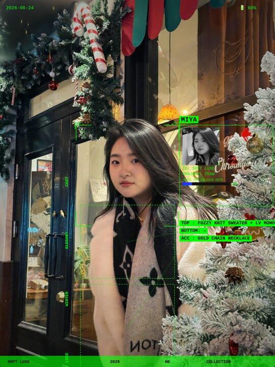

<div align="center">

# 📸 Lookbook FX

### 监控追踪风时尚效果图生成器

> 传一张人物照片 → AI 识别服装 → 自动生成追踪框效果图

[](LICENSE)
[](SKILL.md)
[](https://nodejs.org)

<br>



</div>

---

## ✨ 效果

用户传一张人物照片，Skill 自动完成：

- 🔍 **人脸检测** — face-api.js 定位人脸，自动放置追踪框
- 👕 **服装识别** — Agent 多模态视觉识别上衣/下装/配饰
- 🎯 **HUD 叠加** — L型追踪框 + 信息卡片 + 服装标签连线 + 品牌栏
- 📸 **高清输出** — 1400×1900 PNG，人物保持原色

---

## 🚀 快速开始

### 1. 克隆

```bash
git clone https://github.com/patrickqing20-cell/lookbook-fx.git
cd lookbook-fx
```

### 2. 安装依赖

```bash
bash setup.sh
```

> setup.sh 会自动检查 Chromium / puppeteer-core / 静态服务 / face-api 模型，缺什么装什么。

### 3. 使用

**对话触发**（推荐）：

对 Agent 说 `lookbook` 或 `追踪框` + 传一张照片，全自动出图。

**命令行**：

```bash
node render.js \
  --image photo.jpg \
  --name "KAI" \
  --top "OVERSIZED DENIM JACKET" \
  --bottom "WIDE LEG CARGO PANTS" \
  --output output.png
```

**Web UI**：

部署后打开 `http://localhost:8080/artifacts/lookbook-fx.html`，上传图片在线预览。

---

## 🎨 可自定义参数

用户可以在消息中指定任意参数，未指定的由 AI 自动识别：

| 参数 | 用户说法 | 示例 |
|------|---------|------|
| 名字 | `名字叫XX` / `name XX` | "名字叫 SAKURA" |
| HUD颜色 | `用绿色/红色/青色/橙色/白色` | "用红色框" |
| 品牌 | `品牌XX` / `ID XX` | "品牌写 GUCCI" |
| 系列 | `系列XX` / `project XX` | "系列 26SS" |
| 上衣 | `上衣写XX` / `top XX` | "上衣写 SILK BLOUSE" |
| 下装 | `下装写XX` / `bottom XX` | "下装写 PLEATED SKIRT" |
| 配饰 | `配饰XX` / `acc XX` | "配饰：墨镜" |
| 风格词 | `关键词 A B C D` | "关键词 DARK MINIMAL EDGY COOL" |

### 颜色选项

| 颜色 | 色值 | 用户说 |
|------|------|--------|
| 🟢 绿 | `#00ff00` | 绿色 / green（默认）|
| 🔵 青 | `#00ffff` | 青色 / cyan |
| 🔴 红 | `#ff3366` | 红色 / red |
| 🟠 橙 | `#ffaa00` | 橙色 / orange |
| ⚪ 白 | `#ffffff` | 白色 / white |

---

## 🔧 交互方式

### 方式 1：纯传图（全自动）
```
用户：lookbook + [图片]
Agent：自动识别所有信息 → 出图
```

### 方式 2：传图 + 自定义
```
用户：lookbook 名字YUKI 用青色 + [图片]
Agent：名字和颜色用指定值，服装自动识别 → 出图
```

### 方式 3：出图后修改
```
用户：名字改成 LUNA
Agent：只改名字，其他不变 → 重新出图
```

---

## 📁 文件结构

```
lookbook-fx/
├── README.md               # 本文件
├── SKILL.md                # Skill 定义（触发词 + 完整链路）
├── render.js               # Puppeteer 渲染脚本
├── setup.sh                # 首次安装自检脚本
├── preview.jpg             # 效果预览图
├── LICENSE
└── public/
    ├── lookbook-fx.html    # 前端页面（HUD 渲染 + 人脸检测）
    └── face-models/        # face-api.js + 人脸检测模型权重
        ├── face-api.min.js
        ├── ssd_mobilenetv1_model-*      # SSD 模型（精度高）
        └── tiny_face_detector_model-*   # Tiny 模型（fallback）
```

---

## ⚙️ 环境要求

| 依赖 | 说明 | 宝子沙箱 |
|------|------|---------|
| Chromium | Headless 浏览器（port 9222）| ✅ 预装 |
| Node.js 18+ | 运行渲染脚本 | ✅ 预装 |
| puppeteer-core | 浏览器控制 | `setup.sh` 自动装 |
| 静态文件服务 :8080 | 页面托管 | ✅ 预装 |
| face-api.js | 人脸检测 | 包内自带 |
| ImageMagick | 大图压缩（可选）| ✅ 通常预装 |
| **Agent 多模态能力** | 看图识别服装 | 需要 LLM 支持视觉 |

---

## 🛠️ 工作原理

```
用户传图
  │
  ▼
Agent 视觉识别（LLM 多模态）
  │  识别：上衣 / 下装 / 配饰 / 风格
  ▼
render.js（Puppeteer）
  │  ① 打开 lookbook-fx.html
  │  ② 填入识别结果
  │  ③ 上传图片 → face-api.js 检测人脸
  │  ④ Canvas 渲染 HUD 叠加层
  │  ⑤ 截图导出 PNG
  ▼
返回效果图（1400×1900）
```

---

## 📝 Changelog

### v1.1.0
- 新增用户自定义参数（名字/颜色/品牌/服装/关键词）
- 新增出图后修改能力
- 新增 setup.sh 一键部署
- 优化 canvas tainted fallback（2x DPR 截图）

### v1.0.0
- 初始版本
- 人脸检测 + 全自动服装识别 + HUD 渲染
- 7 种布局模板（后精简为 Classic 单模板）

---

<div align="center">

**Patrick / 青山** — AI 创作工具链构建者

*每张照片都值得一个追踪框。*

MIT License © Patrick

</div>
